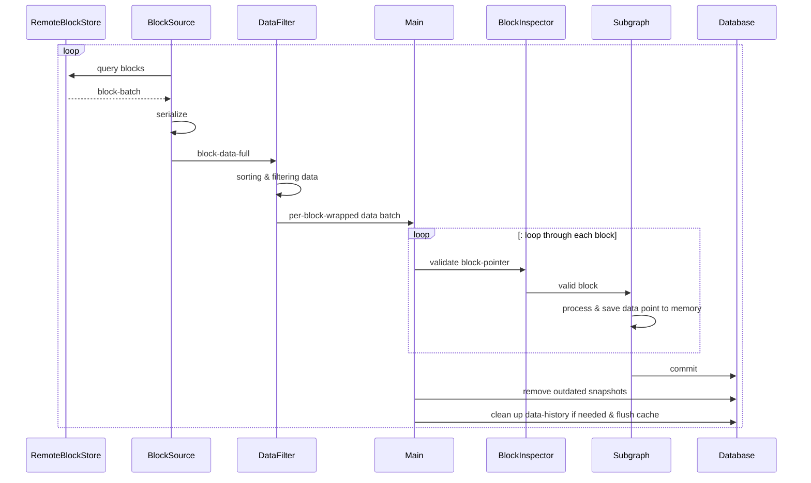

# Datafast-Runtime

Document available at [https://github.com/vutran1710](https://runtime.datafast.network/)

## Architecture


## Unit-Test

### Testing everything
1. Clone both this reop & [subgraph-testing](https://github.com/hardbed/subgraph-testing) repo and put them under the same directory
```shell
any-parent-dir $: git clone github.com/hardbed/subgraph-testing
any-parent-dir $: git clone github.com/hardbed/subgraph-wasm-runtime
```

2. Build the test suites first with [subgraph-testing](https://github.com/hardbed/subgraph-testing)
```shell
# install dependencies first if neccessary
subgraph-testing $: pnpm install
subgraph-testing $: pnpm build
```

3. In this repo, run test
```shell
subgraph-wasm-runtime $: RUST_LOG=info cargo test
```
