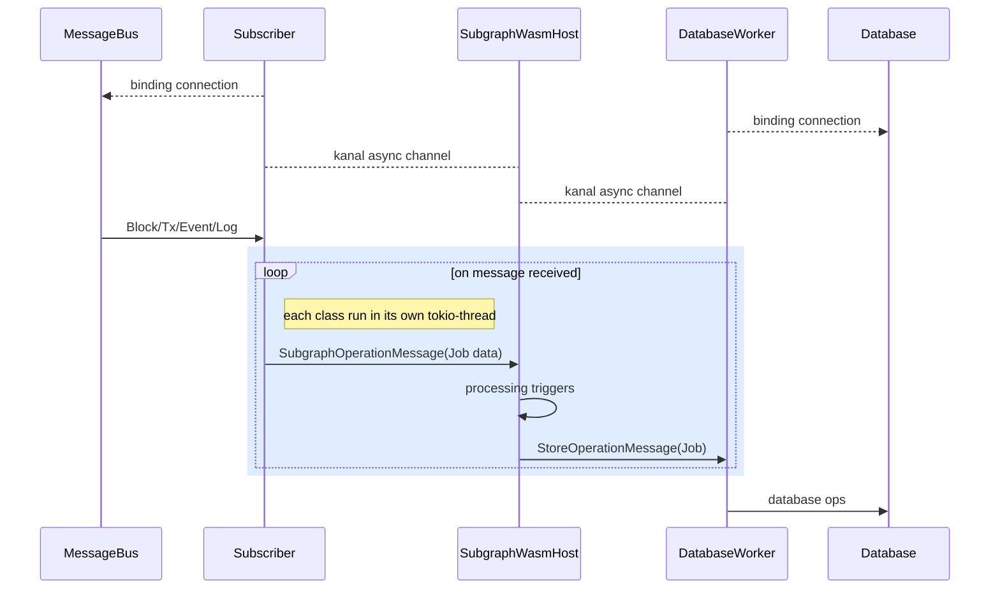

# Subgraph WASM Runtime

## Architecture

```mermaid
sequenceDiagram
    participant MessageBus
    participant Subscriber
    participant SubgraphWasmHost
    participant DatabaseWorker
    participant Database

    Subscriber-->>MessageBus: binding connection
    DatabaseWorker-->>Database: binding connection
    Subscriber-->SubgraphWasmHost: kanal async channel
    SubgraphWasmHost-->DatabaseWorker: kanal async channel
    MessageBus->>Subscriber: Block/Tx/Event/Log

    rect rgb(191, 220, 255, .5)
    loop on message received
        note right of Subscriber: each class run in its own tokio-thread
        Subscriber->> SubgraphWasmHost: SubgraphOperationMessage(Job data)
        SubgraphWasmHost->>SubgraphWasmHost: processing triggers
        SubgraphWasmHost->>DatabaseWorker: StoreOperationMessage(Job)
    end
    end

    DatabaseWorker->>Database: database ops
```

## Host Imports Functions

### Testing functions
```
$ RUST_LOG=info cargo test
```
