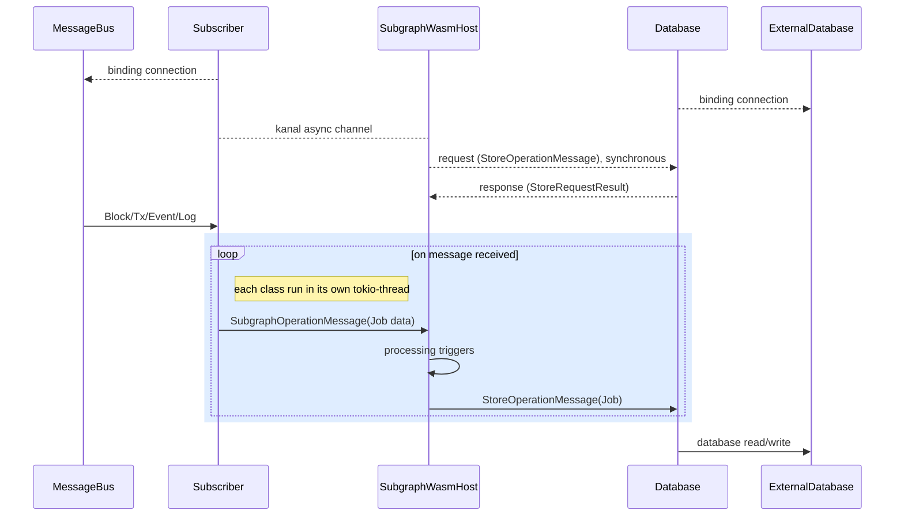

# Subgraph WASM Runtime

## Design goal
The goal design is, the runtime must be very easy to use, very easy to pull a demo.
End-product should be an executable, can be run as CLI or separate Config file.

Example usage:
```shell
$ swr --manifest ~/my-subgraph-repo --subscribe nats://localhost:9000/blocks --store mystore://localhost:12345/namespace
```


## Architecture


## Unit-Test

### Testing everything
1. Clone both this reop & [subgraph-testing](https://github.com/hardbed/subgraph-testing) repo and put them under the same directory
```shell
any-parent-dir $: git clone github.com/hardbed/subgraph-testing
any-parent-dir $: git clone github.com/hardbed/subgraph-wasm-runtime
```

2. Build the test suits first with [subgraph-testing](https://github.com/hardbed/subgraph-testing)
```shell
# install dependencies first if neccessary
subgraph-testing $: pnpm install
subgraph-testing $: pnpm build-test
```

3. In this repo, run test
```shell
subgraph-wasm-runtime $: RUST_LOG=info cargo test
```
